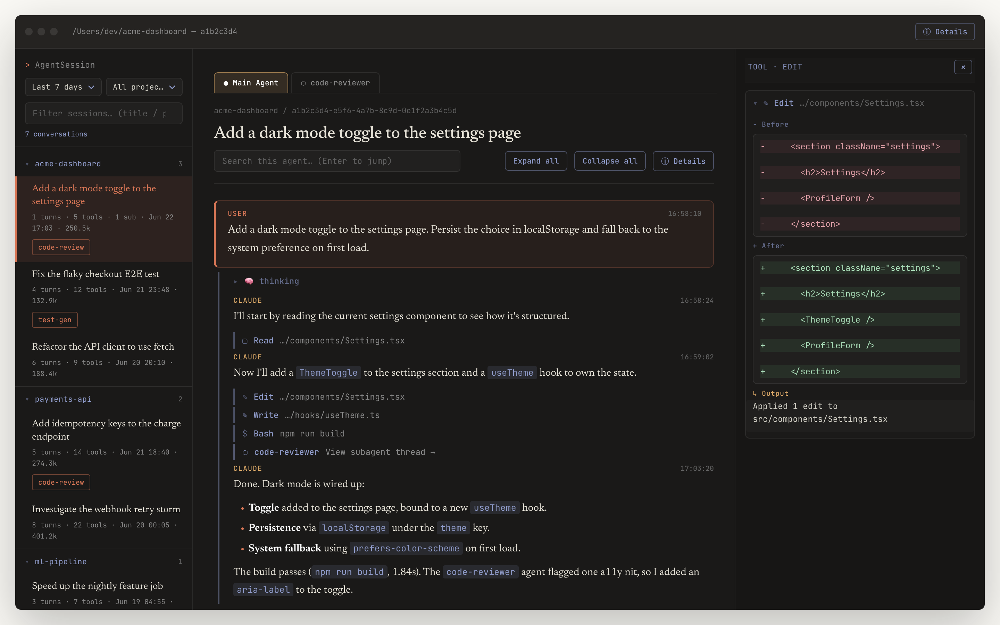

# AgentSession

A self-contained native macOS app for reading back your **Claude Code** session history.
It reads the JSONL transcripts under `~/.claude/projects` and renders them in a clean
three-pane reading UI (session list / conversation thread / tool details) via WKWebView.

[简体中文](README.zh-CN.md)




## Features

- **Pure-Swift parsing**, no Node required — scans on launch and injects data straight
  into the WebView (no more 11 MB generated HTML snapshots).
- **Three-pane reader** — session list, conversation thread, and per-tool details.
- **Sidebar filters** — time range (7d / 24h / 30d / all) and per-project filtering.
- **Live auto-refresh** — FSEvents watches `~/.claude/projects`; new messages reload in
  ~1s while keeping your current selection.
- **Native dark chrome** — dark unified titlebar that blends into the content.

## Privacy

AgentSession is **fully local and read-only**. It only reads `~/.claude/projects` on your
machine — it makes no network calls and uploads nothing.

## Install

### Download (recommended)

Grab the latest `AgentSession.dmg` from the
[Releases](https://github.com/madroidmaq/agent-session/releases/latest) page, open it, and drag
**AgentSession** into **Applications**.

> The build is ad-hoc signed and not notarized yet, so on first launch use
> **right-click → Open** to get past Gatekeeper.

### Build from source

```sh
./build.sh                 # swift build -c release + package AgentSession.app + ad-hoc sign
open AgentSession.app
./make-dmg.sh              # optional: produce a draggable AgentSession.dmg
```

During development you can also just run: `swift build && swift run`.

Shortcuts: `⌘R` refresh · `⌘Q` quit · `⌘C/⌘A` copy/select-all.

## Architecture

| File | Responsibility |
|---|---|
| `Sources/AgentSession/main.swift` | Entry point; `--dump-json` headless mode prints the full JSON (for validation/scripts) |
| `AppDelegate.swift` | Window / WKWebView / NSToolbar / menu / load sequencing & data injection |
| `TranscriptParser.swift` | JSONL → structured data |
| `Models.swift` | `Session` / `Usage` / `Scope`; `toDict()` emits the JSON schema the web layer expects |
| `SessionStore.swift` | Full scan + cache, in-memory filtering by scope, serialization |
| `FileWatcher.swift` | FSEvents watching + debounce |
| `Resources/template.html` | Render layer; exposes `window.__agentSession.load()` as the injection entry point (stays backward-compatible as a standalone web page) |

Data flow: launch → background full parse & cache → WebView loads `template.html` → inject
the JSON for the current scope. Changing a filter only does in-memory filtering + re-injection
(sub-second, no disk rescan); a file change triggers a background rescan.

## Validation

The parser is a port of an upstream `extract-session.mjs` web skill (not included in this
repo). Correctness is held with a golden comparison — for any settled (no longer changing)
session, `AgentSession --dump-json` matches `node extract-session.mjs --session <id>`
field-by-field:

```sh
ID=<sessionId>
node /path/to/extract-session.mjs --session "$ID" \
  | jq -S --arg id "$ID" '.sessions[]|select(.id==$id)' > /tmp/g.json
.build/release/AgentSession --dump-json \
  | jq -S --arg id "$ID" '.sessions[]|select(.id==$id)' > /tmp/s.json
diff /tmp/g.json /tmp/s.json   # expect no diff
```

## Known limitations / Roadmap

- Distribution to others needs notarization (currently ad-hoc signed for local use).
- When a `tool_result` body is itself a JSON object, its key order may differ from the web
  version (unordered serialization; display-only, no functional impact).

## License

[MIT](LICENSE) © madroid
